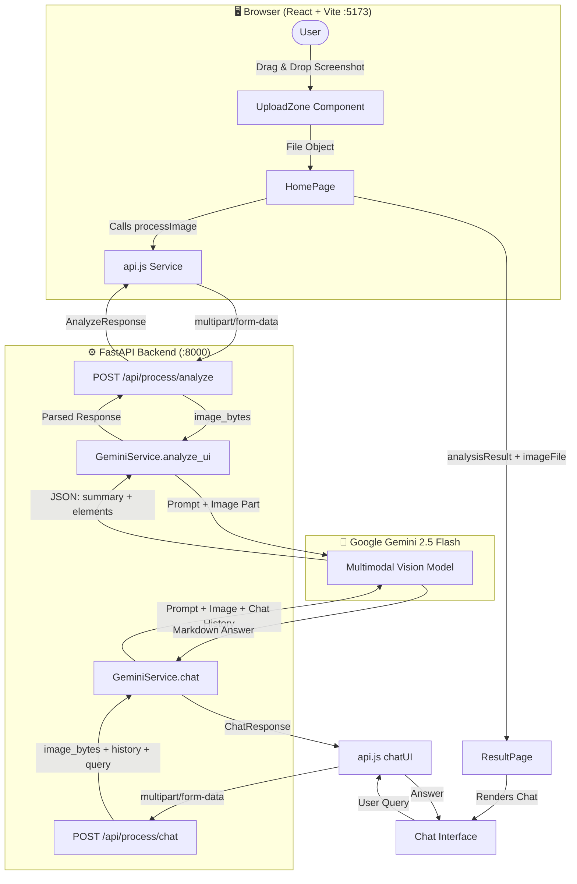
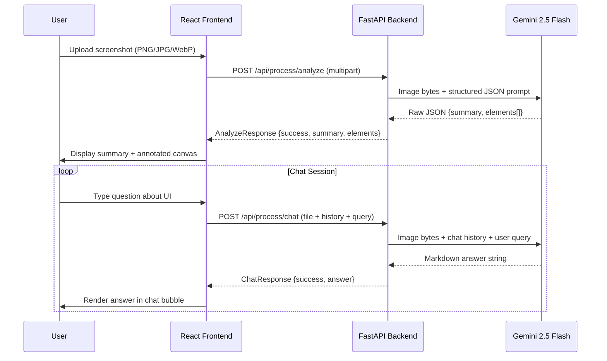
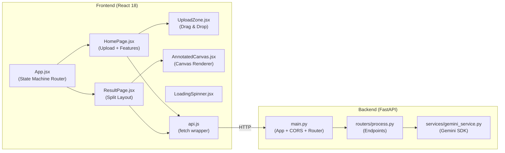
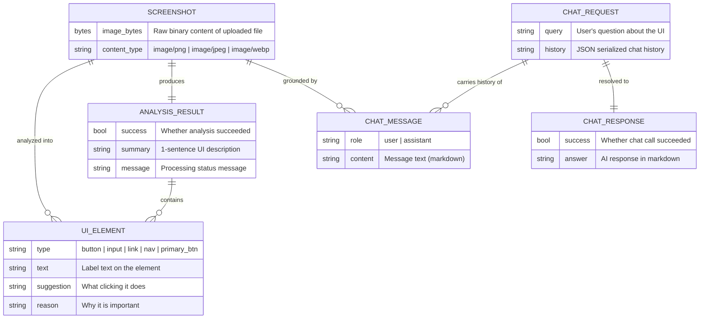

<div align="center">

# 🤖 AI UI Assistant

### _Understand Any UI. Instantly._

[](https://python.org)
[](https://fastapi.tiangolo.com)
[](https://reactjs.org)
[](https://vitejs.dev)
[](https://ai.google.dev)
[](https://tailwindcss.com)
[](LICENSE)

**A production-grade, conversational AI assistant that analyzes any UI screenshot and guides you through it step-by-step — powered by Google Gemini 2.5 Flash Vision.**

[🚀 Quick Start](#-quick-start) · [✨ Features](#-features) · [🏗 Architecture](#-architecture) · [📡 API Reference](#-api-reference) · [🗺 Roadmap](#-future-roadmap)

---

</div>

## 📸 What It Does

Upload **any UI screenshot** — a web app, mobile app, SaaS dashboard, e-commerce page — and the AI will:

1. **Instantly analyze** the interface and identify key interactive elements (buttons, inputs, navigation, links).
2. **Summarize the UI** in plain English so you understand what you're looking at.
3. **Chat with you conversationally** — ask *"How do I check out?"* or *"Where is the settings menu?"* and get precise, click-by-click guidance.

---

## 🎥 Demo


## ✨ Features

| Feature | Description |
|---|---|
| ⚡ **Sub-Second Vision Analysis** | Gemini 2.5 Flash Vision analyzes uploaded screenshots in under 3 seconds |
| 💬 **Conversational Chat Agent** | Multi-turn chat with full history context over the uploaded image |
| 🖼 **Annotated Canvas Viewer** | Color-coded bounding boxes drawn over detected UI elements with hover tooltips |
| 🔍 **Smart Element Categorization** | Distinguishes between primary buttons, inputs, nav links, social buttons, and more |
| 📥 **Download Annotated Image** | Export the analyzed screenshot with all annotation overlays |
| 🔒 **Privacy-First & Local** | Your images stay on your machine — no third-party cloud storage |
| 🔄 **Hot-Reload Dev Experience** | Both backend (`--reload`) and frontend (Vite HMR) support instant code updates |
| 📦 **Docker Ready** | Backend ships with a `Dockerfile` for containerized deployments |

---

## 🏗 Architecture

### High-Level System Flow



### Request / Response Data Flow



### Component Architecture



### Entity Relationship Diagram



---

## 💻 Tech Stack

### Backend
| Technology | Version | Role |
|---|---|---|
| **Python** | 3.10+ | Runtime |
| **FastAPI** | 0.111+ | REST API framework |
| **Uvicorn** | latest | ASGI server |
| **google-genai** | latest | Official Gemini SDK (new) |
| **Pillow (PIL)** | latest | Image preprocessing |
| **python-dotenv** | latest | `.env` loading |
| **python-multipart** | latest | File upload parsing |
| **Pydantic** | v2 | Request/response validation |

### Frontend
| Technology | Version | Role |
|---|---|---|
| **React** | 18.3 | UI framework |
| **Vite** | 5.4 | Build tool & dev server |
| **TailwindCSS** | 3.4 | Utility-first styling |
| **Lucide React** | 0.372 | Premium icon library |
| **Canvas API** | native | Image annotation rendering |

### AI / Cloud
| Service | Model | Purpose |
|---|---|---|
| **Google Gemini** | `gemini-2.5-flash` | Multimodal vision & chat |
| **Google AI Studio** | — | API key management |

---

## 🚀 Quick Start

### Prerequisites
- Python 3.10+
- Node.js 18+
- A free [Google AI Studio](https://aistudio.google.com/) API key

---

### 1️⃣ Clone the Repository

```bash
git clone https://github.com/VivekJariwala50/ai-ui-assistant.git
cd ai-ui-assistant
```

---

### 2️⃣ Backend Setup

```bash
cd backend

# Create and activate virtual environment
python -m venv venv

# Windows
venv\Scripts\activate
# macOS / Linux
source venv/bin/activate

# Install dependencies
pip install -r requirements.txt

# Configure your API key
cp .env.example .env
# Open .env and set your key:
#   GEMINI_API_KEY=your_actual_api_key_here

# Start the backend server
uvicorn app.main:app --reload --port 8000
```

✅ Backend running at: `http://localhost:8000`  
📖 Swagger UI available at: `http://localhost:8000/docs`

---

### 3️⃣ Frontend Setup

```bash
# Open a NEW terminal tab
cd frontend

# Install dependencies
npm install

# Start the dev server
npm run dev
```

✅ Frontend running at: `http://localhost:5173`

---

### 4️⃣ Use It!

1. Open `http://localhost:5173` in your browser.
2. **Drag & drop** any UI screenshot (PNG, JPG, WebP) into the dropzone, or click **"Select from computer"**.
3. Wait ~2–3 seconds for Gemini to analyze the image.
4. View the **UI summary** and **key element list** in the chat panel.
5. **Ask questions** in the chat box, e.g.:
   - *"How do I add an item to my cart?"*
   - *"Where is the sign-up button?"*
   - *"What does the blue button in the top-right do?"*

---

### 🐳 Docker (Backend Only)

```bash
cd backend
docker build -t ai-ui-assistant-backend .
docker run -p 8000:8000 -e GEMINI_API_KEY=your_key ai-ui-assistant-backend
```

---

## 📡 API Reference

### `POST /api/process/analyze`

Analyzes an uploaded UI screenshot.

**Request**: `multipart/form-data`

| Field | Type | Description |
|---|---|---|
| `file` | `File` | Image file (PNG / JPG / WebP) |

**Response**: `application/json`

```json
{
  "success": true,
  "summary": "A SaaS dashboard showing sales metrics and a navigation sidebar.",
  "elements": [
    {
      "type": "button",
      "text": "Export CSV",
      "suggestion": "Downloads the data table as a CSV file.",
      "reason": "Primary data export action"
    }
  ],
  "message": "Successfully analyzed image."
}
```

---

### `POST /api/process/chat`

Answers a question about the uploaded UI.

**Request**: `multipart/form-data`

| Field | Type | Description |
|---|---|---|
| `file` | `File` | Same image as analyze call |
| `query` | `string` | User's question |
| `history` | `string` | JSON-encoded array of `{role, content}` messages |

**Response**: `application/json`

```json
{
  "success": true,
  "answer": "To export data, click the **Export CSV** button located in the top-right corner of the data table."
}
```

---

## 📁 Project Structure

```
ai-ui-assistant/
├── backend/
│   ├── app/
│   │   ├── __init__.py
│   │   ├── main.py                  # FastAPI app, CORS, router mounting
│   │   ├── routers/
│   │   │   └── process.py           # /analyze and /chat endpoints
│   │   └── services/
│   │       └── gemini_service.py    # Google Gemini 2.5 Flash integration
│   ├── .env                         # Local secrets (not committed)
│   ├── .env.example                 # Template for new users
│   ├── Dockerfile                   # Container config
│   ├── requirements.txt             # Python dependencies
│   ├── test_gemini.py               # Quick API health check script
│   └── list_models.py               # List available Gemini models
│
└── frontend/
    ├── src/
    │   ├── components/
    │   │   ├── AnnotatedCanvas.jsx  # Canvas with color-coded element overlays
    │   │   ├── UploadZone.jsx       # Drag-and-drop file uploader
    │   │   └── LoadingSpinner.jsx   # Animated loading indicator
    │   ├── pages/
    │   │   ├── HomePage.jsx         # Landing page with upload zone
    │   │   └── ResultPage.jsx       # Split layout: image + chat panel
    │   ├── services/
    │   │   └── api.js               # fetch wrappers for backend calls
    │   ├── App.jsx                  # Client-side router (state machine)
    │   ├── main.jsx                 # React entry point
    │   └── index.css                # Global styles
    ├── index.html
    ├── vite.config.js
    ├── tailwind.config.js
    └── package.json
```

---

## 🗺 Future Roadmap

### 🔜 Near-Term (v1.1)
- [ ] **Accessibility Audit Mode** — Automatically flag contrast issues, missing ARIA labels, and tab-order problems
- [ ] **Element Confidence Scores** — Display AI confidence levels as visual progress bars
- [ ] **Session History** — Save and revisit previous UI analyses in a sidebar
- [ ] **Keyboard Navigation Mode** — Full keyboard-shortcut support for power users

### 🚧 Mid-Term (v2.0)
- [ ] **Multi-Page Flow Analysis** — Upload multiple screenshots and let the AI trace user journeys
- [ ] **UX Suggestion Engine** — Proactive suggestions like *"Your CTA is below the fold — consider moving it"*
- [ ] **Figma Plugin** — Analyze frames directly from Figma without screenshotting
- [ ] **Browser Extension** — One-click screenshot and analysis of the current browser tab
- [ ] **Export to PDF Report** — Generate a branded accessibility and UX audit PDF

### 🔭 Long-Term (v3.0)
- [ ] **Voice-Controlled Navigation** — Speak your question instead of typing
- [ ] **Video Walkthrough Recording** — Record and annotate step-by-step UI interaction flows
- [ ] **Multi-LLM Support** — Swap between Gemini, GPT-4o, and Claude via a settings panel
- [ ] **Team Collaboration** — Share analyzed UIs with teammates and add annotations collaboratively
- [ ] **CI/CD Integration** — Run visual regression tests automatically in GitHub Actions pipelines
- [ ] **Mobile App** — iOS / Android app with direct camera capture and analysis

---

## 🤝 Contributing

Contributions are welcome! Here's how to get started:

1. Fork the repository.
2. Create a feature branch: `git checkout -b feature/your-feature-name`
3. Commit your changes: `git commit -m 'feat: add amazing feature'`
4. Push to your branch: `git push origin feature/your-feature-name`
5. Open a Pull Request.

Please follow the [Conventional Commits](https://www.conventionalcommits.org/) standard for commit messages.

---

## 📜 License

MIT License © 2024 [Vivek Jariwala](https://github.com/VivekJariwala50)

---

<div align="center">
  <strong>Built with ❤️ using Google Gemini 2.5 Flash · FastAPI · React · Vite</strong>
</div>
